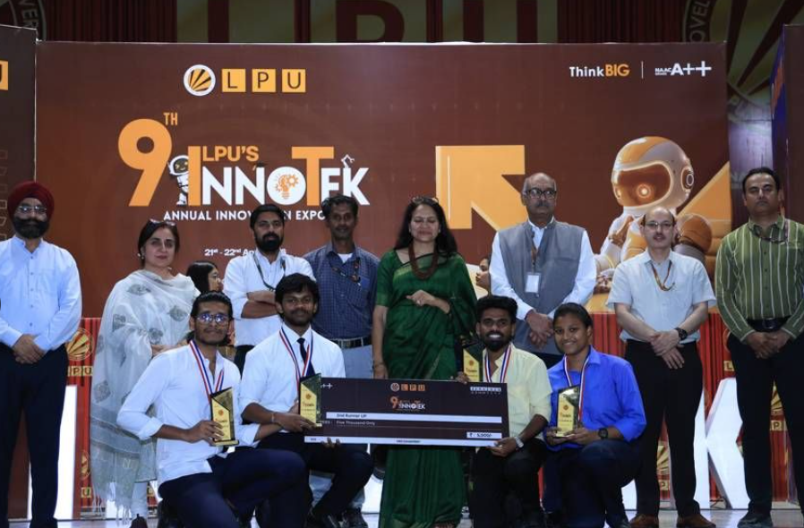
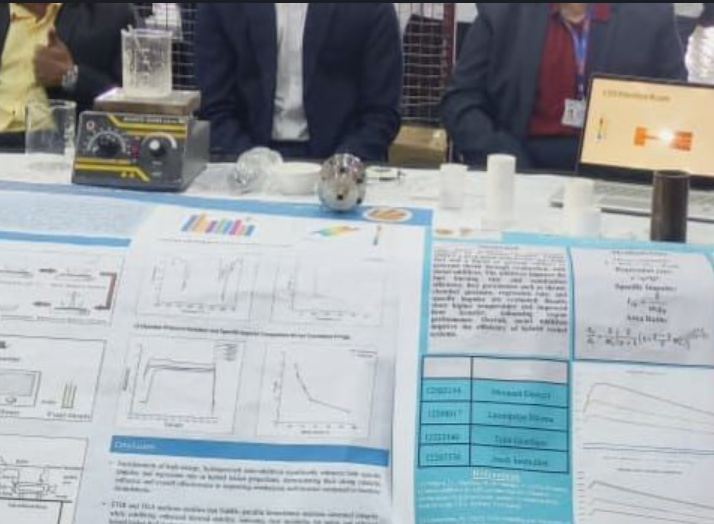
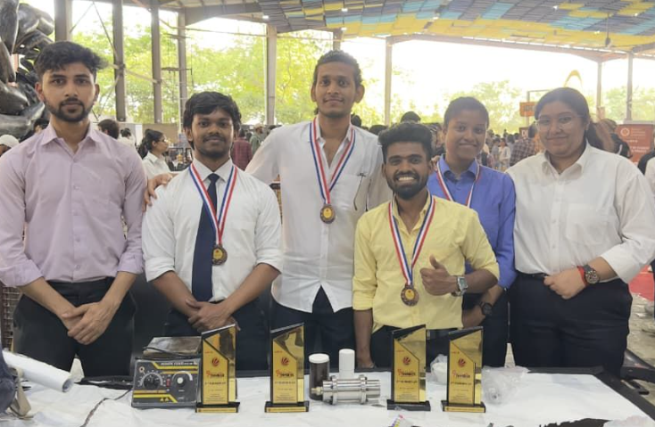

# 🚀 Hybrid Rocket Motor Development

## Project Overview

This project presents the design, computational analysis, and prototype development of a **100 N-class Hybrid Rocket Motor** using **Paraffin Wax** as the fuel and **Liquid Oxygen (LOX)** as the oxidizer.

The project investigated the influence of energetic additives on propulsion performance through thermochemical analysis using NASA CEA, followed by CAD modelling, prototype fabrication, and experimental validation.

Developed as the Capstone Project for the B.Tech Aerospace Engineering program at Lovely Professional University.

---

# 🎯 Objectives

- Design a 100 N-class hybrid rocket motor.
- Perform propulsion performance analysis using NASA CEA.
- Investigate the influence of Aluminum and Lithium-based additives.
- Design injector, combustion chamber, and nozzle components.
- Develop complete CAD assemblies.
- Fabricate a functional prototype.
- Validate the propulsion system through experimental testing.

---

# ⚙️ Motor Specifications

| Parameter | Value |
|------------|---------|
| Design Thrust | 100 N |
| Burn Duration | 2 s |
| Chamber Pressure | 25 bar |
| Fuel | Paraffin Wax |
| Oxidizer | Liquid Oxygen (LOX) |
| Nozzle Type | Converging-Diverging |
| Grain Geometry | Cylindrical |

---

# 🛠️ Design & Development

The hybrid rocket motor was developed through a systematic engineering workflow involving:

- Propellant selection
- NASA CEA thermochemical analysis
- Fuel grain design
- Injector design
- Nozzle optimization
- CAD modelling
- Prototype fabrication
- Performance evaluation

---

# 📊 Performance Analysis

The propulsion system was evaluated using NASA CEA for multiple fuel-additive combinations.

## Best Predicted Performance

| Fuel Combination | Specific Impulse (s) |
|------------------|----------------------|
| Paraffin + Aluminium | 279.78 |
| Paraffin + LiAlH₄ | 278.62 |
| Paraffin + LiBeH₄ | 280.75 |

### Key Outcomes

- Successfully designed a 100 N hybrid rocket motor.
- Achieved successful ignition.
- Demonstrated approximately 2 seconds of stable combustion.
- Compared propulsion performance for different energetic additives.
- Developed a complete CAD assembly and fabrication workflow.

---

# 📷 Project Gallery

## Blueprint

## CAD Assembly

## Isometric Model

## Injector Plate

## Nozzle Design

## Fabricated Prototype

---

# 📈 Performance Results

### NASA CEA Performance Analysis

### Thermochemical Comparison

---

# 🏆 Awards & Recognition

**2nd Runner-Up**

**9th Innotek Annual Innovation Expo 2026**

Project:

**Computational Performance of Hybrid Rocket Motor Loaded with Fuel and Additives**

### Event Gallery

---

# 🧰 Software & Tools

- NASA CEA
- Creo Parametric
- CAD Design
- Aerospace Propulsion Analysis
- Engineering Design Calculations

---

# 💡 Skills Demonstrated

- Rocket Propulsion
- Hybrid Rocket Motor Design
- Propellant Selection
- NASA CEA Analysis
- CAD Modelling
- Prototype Fabrication
- Engineering Design
- Aerospace Systems Engineering

---

# 📄 Technical Report

Complete project documentation is available here:

📄 **[Capstone Project Report](report/Capstone_Project_Report.pdf)**

---

# 🚀 Future Scope

- Static firing with instrumentation
- Combustion efficiency optimization
- Alternative oxidizer evaluation
- Higher thrust-class motor development
- Thermal protection analysis
- Flight-ready hybrid propulsion system

---

# 👤 Author

**Laxmipriya Murmu**

B.Tech Aerospace Engineering

Lovely Professional University

---

# 👨‍🏫 Faculty Mentor

**Mr. Harikrishna Chavan**

Department of Aerospace Engineering

Lovely Professional University
