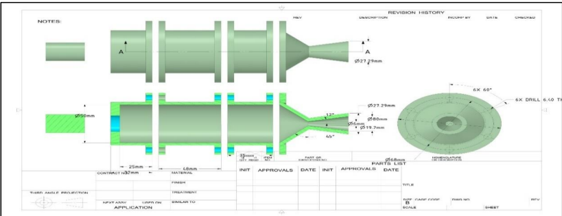
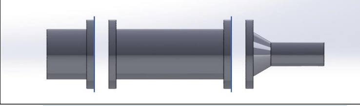
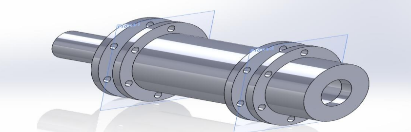
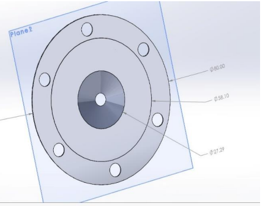
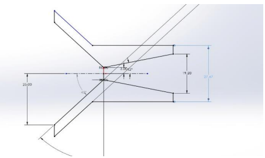
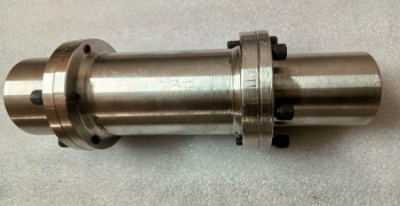
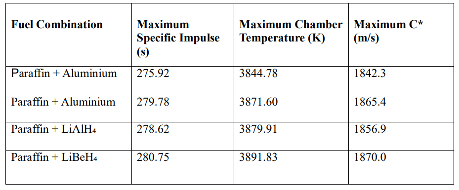
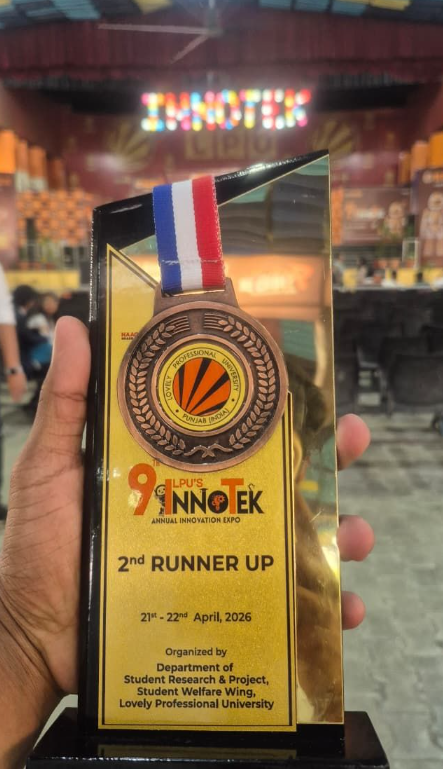
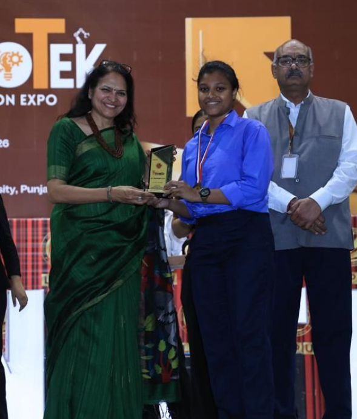
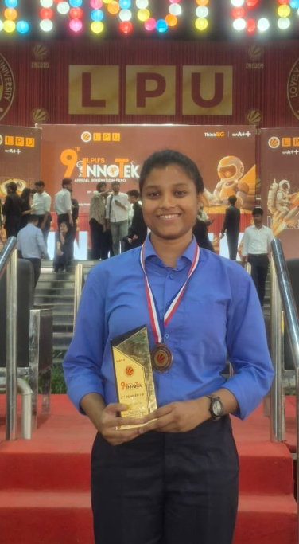

# Hybrid Rocket Motor

## Overview

This project focuses on the design, computational analysis, and prototype development of a 100 N-class hybrid rocket motor using paraffin-based fuel blended with energetic additives and Liquid Oxygen (LOX) as the oxidizer.

The work was carried out as a Capstone Project in Aerospace Engineering at Lovely Professional University.

---

## Project Objectives

- Design a 100 N-class hybrid rocket motor
- Analyze propulsion performance using NASA CEA
- Study the influence of Aluminum and LiBH₄ additives
- Develop CAD models of the motor assembly
- Manufacture a working prototype
- Validate design feasibility through testing

---

## Key Specifications

| Parameter | Value |
|------------|---------|
| Design Thrust | 100 N |
| Burn Duration | 2 s |
| Chamber Pressure | 25 bar |
| Fuel | Paraffin Wax |
| Oxidizer | Liquid Oxygen (LOX) |
| Nozzle Type | Converging-Diverging |
| Grain Geometry | Cylindrical |

---

## Technologies Used

- NASA CEA
- Creo Parametric
- Aerospace Propulsion Analysis
- CAD Design
- Engineering Design Calculations

---

## Results

### Best Predicted Performance

| Fuel Combination | Specific Impulse (s) |
|------------------|----------------------|
| Paraffin + Aluminium | 279.78 |
| Paraffin + LiAlH₄ | 278.62 |
| Paraffin + LiBeH₄ | 280.75 |

### Key Achievements

- Successfully designed a 100 N hybrid rocket motor
- Achieved successful ignition
- Demonstrated approximately 2 seconds of stable combustion
- Evaluated additive effects on propulsion performance
- Developed complete CAD assembly and manufacturing workflow

---

## CAD Models

### Complete Assembly Blueprint

### CAD Assembly

### Isometric Model

---

## Design Components

### Injector Plate

### Nozzle Geometry

---

## Prototype

---

## Performance Analysis

### Thermochemical Comparison

---

## Awards & Recognition

🏆 2nd Runner-Up – 9th Innotek Annual Innovation Expo 2026

Project:
**Computational Performance of Hybrid Rocket Motor Loaded with Fuel and Additives**

### Award Highlights

---

## Project Report

Full report available here:

[Capstone Project Report](report/Capstone_Project_Report.pdf)

---

## Author

**Laxmipriya Murmu**

Aerospace Engineering Undergraduate  
Rocket Propulsion | Space Systems | CFD & Aerodynamics

[LinkedIn](https://www.linkedin.com/in/laxmipriyamurmu/)

[GitHub](https://github.com/laxmipriyamurmu)
